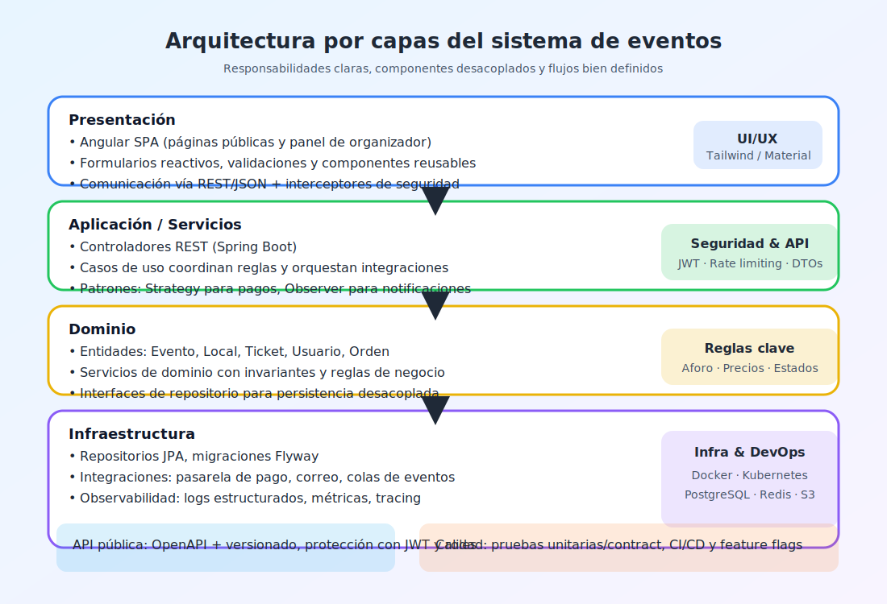
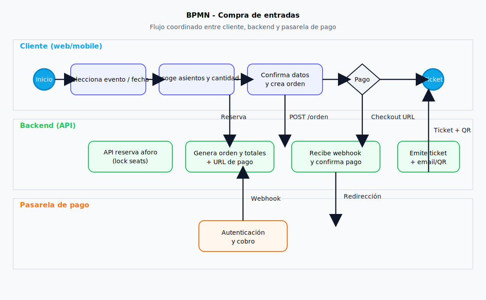
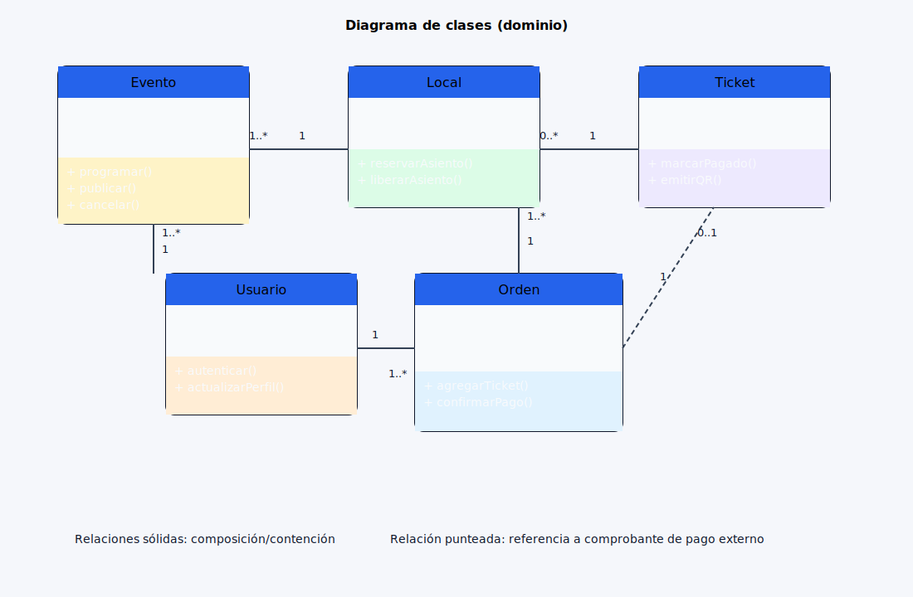
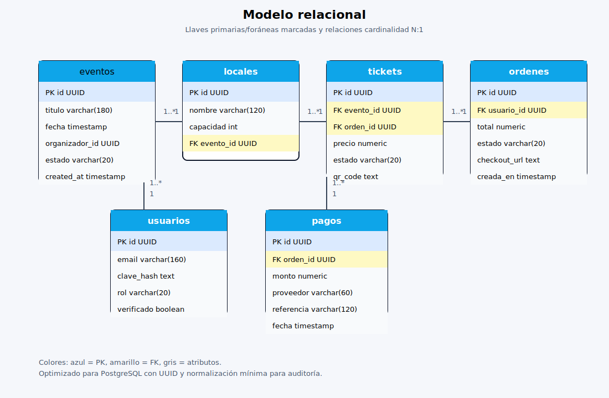
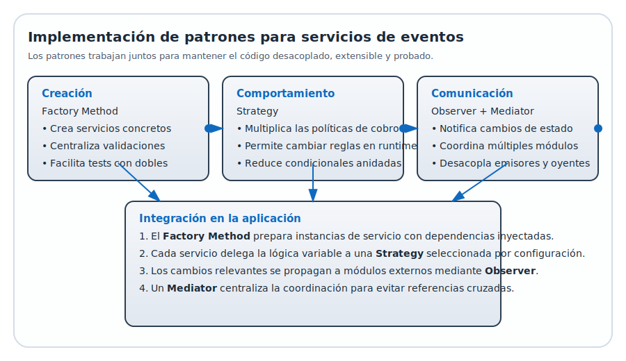

# Diagramas

Visualización directa de la arquitectura, procesos y modelos del sistema.

## Arquitectura por capas

## Modelo de procesos (BPMN)

## Diagrama de clases

## Modelo de datos (ER)

## Implementación de patrones

